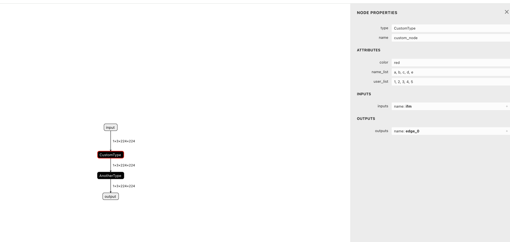

# Custom JSON 模型插件使用说明

[新增JSON解析器插件开发指南.md](./新增JSON解析器插件开发指南.md)

## 命令行

```shell
# 打包
npm run build

# 运行
npm start


# 网页运行
python3 -m http.server 8080
http://localhost:8088/source/index.html
```

##  新增一个json的解析插件



```shell
        修改：     README.md
        新文件：   cds_model_struct.json
        新文件：   image.png
        新文件：   source/cdsmodel.js
        修改：     source/view.js
```
